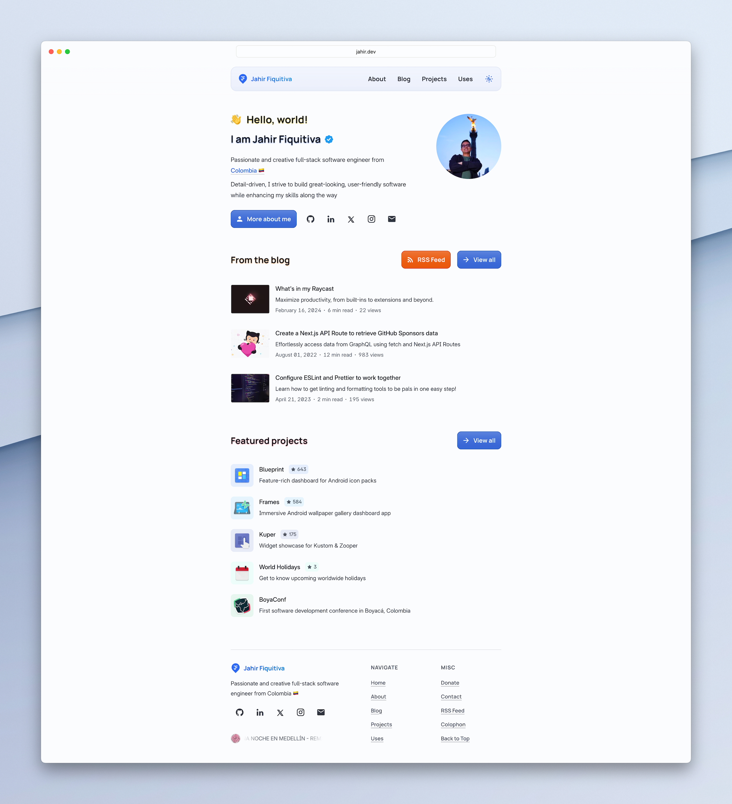

# [jahir.dev](https://jahir.dev)

[](https://github.com/sponsors/jahirfiquitiva)

<picture>
  <source media="(prefers-color-scheme: dark)" srcset="./preview-dark.png">
  <source media="(prefers-color-scheme: light)" srcset="./preview.png">
  
</picture>

## Stack

- **Framework**: [Next.js](https://nextjs.org/)
- **Styling**: [Tailwind CSS](https://tailwindcss.com/)
- **Content**: [MDX](https://github.com/mdx-js/mdx) and [contentlayer](https://contentlayer.dev)
- **Database**: [Neon](https://neon.tech/) and [Drizzle ORM](https://orm.drizzle.team/)
- **Analytics**: [Umami](https://jahir.dev/analytics)
- **Deployment**: [Vercel](https://vercel.com)

## Project Structure

```bash
.
|____config
|____content
|____public
|____scripts
|____src
| |____actions
| |____app
| |____assets
| |____components
| | |____core
| | |____molecules
| | |____og
| | |____views
| | |____icons.ts
| |____data
| |____hooks
| |____lib
| |____providers
| |____styles
| |____types
| |____utils
```

- **`config/*`** - Includes all the custom configuration for MDX, [contentlayer](https://contentlayer.dev) and [Next.js](https://nextjs.org/)
- **`content/*`** - MDX blog posts and the content for the `donate` pages
- **`public/*`** - Static assets including images, fonts, audios, files, etc.
- **`scripts/*`** - Utilities to setup the project
- **`src/app/*`** - Every page and API route in the website. Uses the new [App Router](https://beta.nextjs.org/docs/getting-started#introducing-the-app-router) from [Next.js](https://nextjs.org/) `13.+`
- **`src/assets/*`** - Fonts and static images used in different components
- **`src/components/core/*`** - The simplest components. Most of them are stateless
- **`src/components/molecules/*`** - The main blocks for the website: `toolbar`, `footer`, `main` layout, `back-to-top` button and `social links`
- **`src/components/og/*`** - The code that powers dynamic open-graph images generation
- **`src/components/views/*`** - More complex components to build the different pages of my website. _(They're here to keep `src/app/` as clean as possible)_
- **`src/components/icons.ts`** - SVG icon paths. Icons come from [Material Design Icons](https://pictogrammers.com/library/mdi/) and [Lucide](https://lucide.dev/)
- **`src/data/*`** - JSON files containing data for projects and the [`uses`](https://jahir.dev/uses) page
- **`src/hooks/*`** - A couple hooks used throughout the app
- **`src/lib/*`** - Short for "library", a collection of helpful utilities or code for external services
- **`src/providers/*`** - React Contexts for storing the current theme and blog post reactions
- **`src/styles/*`** - Global styles with `scss`. Mostly use tailwind classes
- **`src/types/*`** - Some types definitions
- **`src/utils/*`** - More utilities functions but less complex than the ones in `lib`

## Running Locally

This application requires Node.js v18.18+.

1. Clone the project, install dependencies and run initial setup

    ```bash
    git clone https://github.com/jahirfiquitiva/jahir.dev.git
    cd jahir.dev
    yarn
    yarn setup # Remove all of my personal content and files
    ```

2. Create a `.env` file similar to [`.env.example`](https://github.com/jahirfiquitiva/jahir.dev/blob/main/.env.example).

3. (Optional) This project uses a postgres database to store the views and reactions count.

    ```postgresql
    CREATE TABLE counters (
      slug VARCHAR(255) PRIMARY KEY NOT NULL,
      views INTEGER NOT NULL DEFAULT 0,
      likes INTEGER NOT NULL DEFAULT 0,
      loves INTEGER NOT NULL DEFAULT 0,
      awards INTEGER NOT NULL DEFAULT 0,
      bookmarks INTEGER NOT NULL DEFAULT 0
    );
    ```

4. Run the project locally:

    ```bash
    yarn dev
    ```

<details>

<summary><strong>Note</strong></summary>

Some things might be broken or not found because the `yarn setup` script will remove many files.
Please double check the code and implementations.

</details>

## Cloning / Forking

Please review the [license](https://github.com/jahirfiquitiva/jahir.dev/blob/main/LICENSE), do not copy it directly, remove all of my personal content and files (resume, blog posts, images, etc.) by running `yarn setup` and please change the styling and colors to match your personal brand. You are free to use this code as inspiration or learning reference but this is not really intended to be a template.

<details>

<summary><strong>Additional changes</strong></summary>

Make sure to set the `IS_TEMPLATE` environment variable to false.
Otherwise, the colors in the website might be inverted. (See `src/styles/globals.scss`)

</details>

## Previous versions

All the previous versions of this website can be found at [jahirfiquitiva/prev-websites](https://github.com/jahirfiquitiva/prev-websites)
